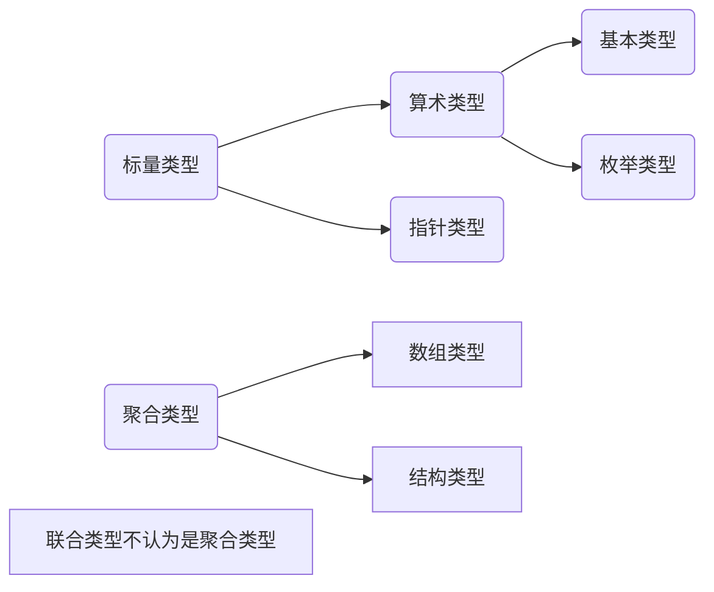

# 第一章C语言基础
## 标识符的命名空间
以下4种可构成独立的命名空间
- 标签名(label)
- 标识(tag), 用来标识结构、联合、枚举类型
- 结构或联合中的成员名称
- 所有其他标识符，也称普通标识符(ordinary identifier)
## 标识符的作用域
- 文件作用域(file scope)
- 块作用域(block scope)
- 函数原型作用域(function prototype scope)
- 函数作用域(function scope)
## 数据类型
- 基本类型
- 枚举类型
- void类型
- 派生类型
	- 指针类型
	- 数据类型
	- 结构类型
- 联合类型
- 函数类型  

- 数据类型:  
	- 对象类型(包括对象存储空间信息)
	- 不完整类型(不包括对象存储空间信息) 如：float fArr[];

