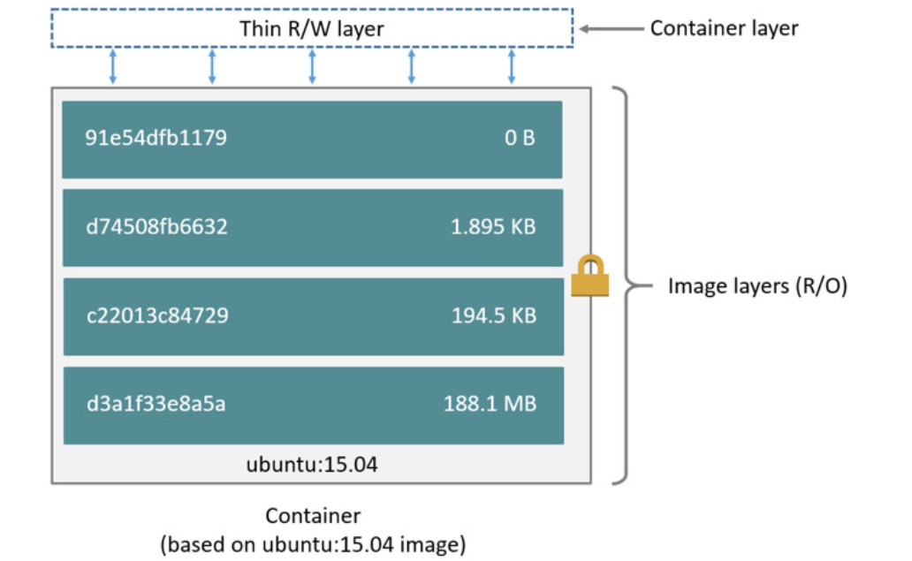
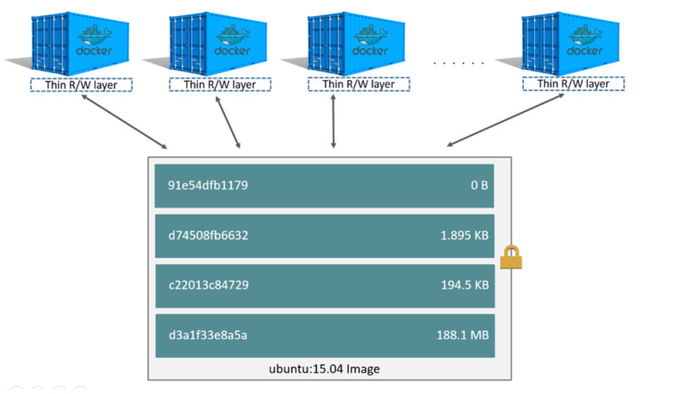

Some workloads require you to be able to write to the container's writable layer.This is where storage drivers come in.

Docker supports several different storage drivers, using a pluggable architecture.The storage driver controls how images and containers are stored and managed on your Docker host.

About storage drivers
---
To use storage drivers effectively,it's important to know how Docker builds and stores images, and how these images are used by containers.

Storage drivers allow you to create data in the writable layer of your container. The files won't be persisted after the container is deleted, and both read and write speeds are lower than native file system performance.

### Images and layers
A Docker image is built up from a series of layers. Each layer represents an instruction in the image's Dockerfile.Each layer except the very last one is read only. Consider the following Dockerfile:
```
FROM ubuntu:18.04
COPY . /app
RUN make /app
CMD python /app/app.py 
```
This Dockerfile contains four commands, each of which creates a layer  
When you create a new container ,you add a new weitable layer on top of the underlying layers.This layer is often called the "container layer". All changes made to  the runnign container are written to this thin writable container layer.The diagram below shows a container based on the Ubuntu15.04 image.

A storage driver handles the details about the way these layers ineract with each other.

Container and layers
---
The major different between a container and an image is the top writable layer.All writes to the container that add or modify existing data are stored in this writable layer.When the container is deleted, the writable layer is also deleted.The underlying image remains unchanged.Multiple containers can share access to the same underlying image and yet have their own data state.


How the overlay2 driver works
---
OverlayerFS layers two directories on a single Linux host and presents them as a single directory.This directories are called layers and the **unification process** is referred to as a **union mount**. OverlayFS refers to the lower directory as lowerdir and the upper directory a upperdir . The unified view is exposed through its own directory called **merged**. 

Image and container layers on-disk
---

> Volumes are completely managed by Docker. While bind mounts are dependent on the directory structure and OS of the host machine.

\***

# Volumes
- Volumes are easier to back up or migrate than bind mounts.
- You can manage volumes using Docker CLI commands or the Docker API.
- Volumes work on both Linux and Windows containers.
- Volumes can be more safely shared among multiple containers.
- Volumes drivers let you store volumes on remore hosts or cloud providers, to encrypt the contents of volumes, or to add other functionality.
- New volumes can have their content pre-populated by a container.
- Volumes on Docker Desktop have much higher performance than bind mounts from Mac and Windows hosts.


Choose the -v or -mount flag
---
