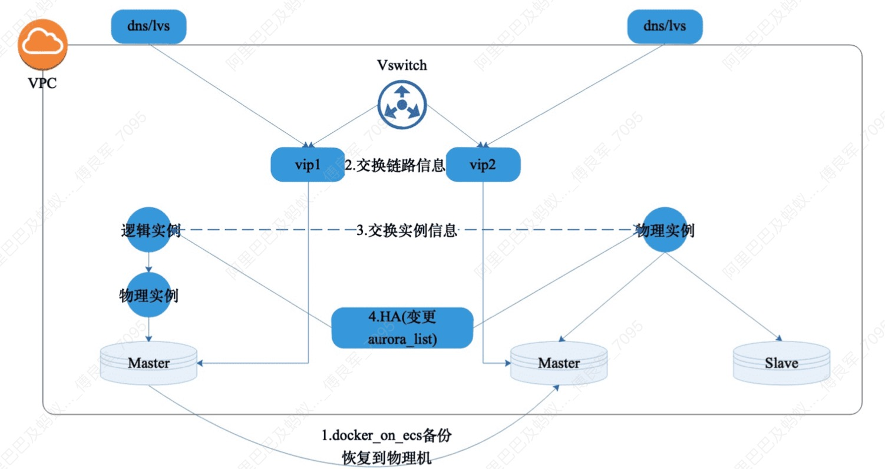

小组个人面试
---
- 五人一小组同时进行面试
- 侧重考生个人和考官的单独交流
- 考生个人背景材料提问
- 小组成员共性话题，考生轮流作答
- 个性化程度和考生个人发挥空间相对更大
- 针对自己的职业履历和岗位经历做好相关个性问题梳理总结
- 个人表达和答题逻辑方面下功夫
- 历年面试真题、英语口语提醒和政治理论材料
政治理论笔试
---
- 历年政治理论真题
- 重大时政热点事件
- 这个可能是口试

问题
---
寒暄、姓名、毕业学校、通过什么认证、为什么继续教育、结尾、英文介绍工作内容

为什么选这个学校/专业、你都看了哪些专业的书籍/做了哪些准备  
如何平衡工作和学习  

-- 简历中的问题
获得的荣誉、你的项目经历、你的职业规划 

2020年疫情会行业的影响、贸易摩擦对行业的影响等S

按不超过1：1.3的复试比例确定参加复试的考生名单  
2020年招生人数320，提前批100多，那么还要招200多  
政治理论考试也采用面试形式进行。

包括沟通表达能力（包括中英文）、逻辑思维能力、工作经验和工作能力、职业规划、发展潜质、政治理论  
综合成绩=初始成绩/3*70% + 复试成绩*30%  
复试成绩满分为100分，低于60，不予录取  
政治理论面试成绩我合格、不合格两种成绩。不合格不予录取  
录取后到当地二甲以上医院体检并将体检表格于6月10日前寄到学校。体检合格予以发放录取通知书

政治
----
- 马克思主义基本理论概论
	- 方法论(理解)
- 中国近现代史纲要
	- 故事(听)
- 毛泽东思想和中国特色社会主义理论体系概论
	- 19大(背)
- 思想道德修养和法律基础
	- 听

MEM 项目介绍
---
注重管理，工程管理。不是实用型的技术。双证。  
除了双证，还有工程师职业资格证书  
专门的校内工程创新与训练中心，与国外知名企业合作建设实践基地  
丰富工程管理实践的行业专家，为开展综合交叉的跨界教学提供条件  
与国外工程领域高水平大学有密切合作  
除了获得浙江大学毕业证书、硕士学位证书之外，经申请和符合条件者可以获得浙江省人社厅颁发的工程师职称系列证书、国际项目经理资质认证（IPMP)证书。，

面试计分表

 2020年浙大工程管理专业硕士面试积分表
 
注意事项：请对5个维度分别评分。8-13表示较差，14-17表示中等，18-20分表示优良

1. 沟通表达能力（满分20）
	- 包括英语沟通能力
	- 考生是否能有效表达事实与观点并与考官进行良好沟通
2. 逻辑思维能力（满分20分）
	- 考生在陈述与回答过程中是否逻辑清晰
3. 工作经验和能力（满分20分）
	- 考生承担工程项目或组织管理工作情况；工作年限等
4. 职业规划（满分20）
	- 考生的职业发展目标是否与工程管理的培养目标即：产业领袖/跨界的工程领域管理专家和高层次的工程应用型人才
5. 发展潜质（满分20分）
	- 考生职业平台及潜在机会等

QA:
---
为什么报考mem?

首先，报考mem跟我想往管理方向发展的职业规划非常的契合，我目前已经具备了一定的技术储备和项目管理经验，理论结合实践,一方面有助于理解课堂上的理论知识，另一方面也可将理论知识应用到实践当中去。

其次，报考mem能够提升我的学历，从而提升职场竞争力，这对我以后不管不是晋升还是跳槽都是非常有帮助的

---

什么是mem?

首先对于我来说是他是工程管理硕士，代表的是研究生学历。并且我能通过mem能系统的学习到管理类知识。  
其次mem项目是浙江大学于2015年设立
MEM是工程管理硕士的缩写, 他将工程技术、经济学和管理科学融为一体，旨在打造复合型高端管理人才。符合我国现代工程事业发展对工程管理人才的迫切需求，

---

你的职业规划是？

---

项目管理基本常识。

---

程序员KPI考核标准？

1. 加班&工时：多数企业最常用的标准
2. 代码行数：最直观但无效的方式
3. 代码质量 ：代码的可读性和可维护性，是否符合规范
4. 工作态度：主观能动性与人际能力

工作态度积极与否确实会影响到团队的配合，写代码不是一个人的事，现在的大型项目往往都需要团队协作。但是这种主观的事，也不仅仅是代码能力的问题了，同时也是人际关系能力的体现。

5. 考勤：一个最无关于工作质量的项目(HR最爱)
6. 工作效率：实现计划的能力（预定周期内完成目标，看有没有delay）
7. 完成质量 ：项目上线后的bug出现率

---
> 个人其他自诉

我本身是一名程序员，在这一行中技术日新月异，在做大项目的时候，运用多种技术，以及多个部门的项目协调配合。然而，引起项目延期，完不成需求的往往是管理方面的问题，比如xxx，yyy。

---

什么是软件项目管理？

所谓软件项目管理就是为了使我们的项目能够按照预定的成本、进度、质量顺利完成，而对人员、产品、过程和项目进行分析和管理的活动。其目的就是让软件项目特别低大型的软件项目的整个软件生命周期（从分析，设计，编码到测试、维护全过程）都能在管理者的控制之下，以预定成本按期，按质的完成软件交付用户使用。

为了使软件项目开发获得成功，关键问题低必须对软件项目的工作范围、可能风险、需要资源（人、软硬件）、要实现的任务、经历的里程碑、花费的工作量（成本）、进度的安排做到心中有数

管理工作要在技术工作开始之前就应该开始，在软件从概念到实现的过程中继续进行，当软件工程最后结束时才终止。

软件其实是一个非常抽象的东西，直到将他做出来。在这一整个过程中，从概念到实现的过程中

软件项目管理的内容包括如下几个方面：  
人员的组织与管理，软件度量，软件项目计划，风险管理，软件质量保证，软件过程能力评估，软件配置管理等。

---

314版本专有云是我主要负责的，需求的划分，工作量的评估分配，风险的评估以及影响范围，这都是我需要考虑的事情。

---

论文方向

软件管理风险可控，预见风险点。

---
## 公司和工作简介
软通动力是一家中国领先的软件与信息技术服务商，提供端对端的数字化解决方案与服务，包括数字化转型咨询，数字化方案设计与实施，云与IT基础设施建设与运维，软件开发与测试服务，数字化运营服务。

我是一名程序员每天的工作就是敲代码，目前是我们开发团队的leader，负责云上数据库项目的开发维护，从需求梳理，任务拆分，在到功能设计开发，以及技术方案的撰写，和coder review。从技术层面识别项目的风险点，保障项目进度。我们做的是mysql数据库系统的管控，主要是保障数据库的高可用，安全性。比如故障迁移，备库重搭，等等。。。

---

- 国家创新驱动发展战略
> 2012年底召开的“十八大”明确提出：“科技创新是提高社会生产力和综合国力的战略支撑，必须摆在国家发展全局的核心位置。”强调要坚持走中国特色自主创新道路、实施创新驱动发展战略。这是我们党放眼世界、立足全局、面向未来作出的重大决策。
> "创新驱动发展"战略有两层含义：
> 一是中国未来的发展要靠科技创新驱动，而不是传统的劳动力以及能源驱动
> 二是创新的目的是驱动发展，而不是发表高水平论文
- 中国智造2025
> 数字化转型
- 工业4.0
> 工业1.0 蒸汽机诞生，机器生产代替手工劳动(机械化)
> 工作2.0 电力驱动产品大规模生产(电气化)
> 工业3.0 计算机出现，自动化程度大幅度上升(自动化)
> 工业4.0 智慧化 物联网IOT AI 大数据 智慧工厂 快速上市 客制化
- 十三五规划(2016-2020	)
> 是全面建成小康社会决胜阶段
- 区块链
- 中印冲突
- 贸易摩擦
- 

如果说MBA（工商管理硕士）培养的是商业领袖，解决的是企业中经营管理问题。ME（工程硕士），培养的是技术领袖，解决的是工程中的技术问题。那么，MEM（工程管理硕士），培养的则是产业化领袖，解决的是工程中管理问题。

---
## 概述
- Mysql风险大盘
	- 8大类，17小类异常
	- Stat异常巡检数据采集（参数不一致巡检）
	- 异常数据统计归档任务
	- 异常数据示例查询及历史趋势
	- TODO：参数异常修复，内核版本问题修复，待接入酒保
- 组件日常维护及发布
	- 新组件拆分：rdsapi-ext-maxscale, rdsapi-ext-mssql, rdsapi-ext-pgsql
	- Maxscale路由支持：支持同引擎多版本路由，支持rpcGroup拆分路由（区分基础服务与业务服务）
	- 支持专享集群拆分：无kindcode或不关心kindcode路由，支持按照功能路由方式
	- 管控组件docker化改造及一键迁移；
		1. rdsapi-ext-mysql全部改造替换完毕，支持一键迁移；
		2. rdsapi全部改造完毕，支持一键迁移
		3. sls/sunfire监控重新安装/配置，保证现有API监控，并建立海外单元的SLS日志采集，目前全单元均建立sls日志库，为后续监控提供支持
		4. 以上过程未造成任何故障
	- 本地盘失败任务治理
		1. 最终本地盘失败任务，每周少于200个，失败，失败率0.5%~1%
		2. S2本地盘导致故障少于3个；失败，mysql5.5主备宕，mariadb挂，备库异常变配后HA反复切换
		3. 非预期参数巡检；有，支持指定参数巡检和元数据与实力参数一致性巡检。
		4. 反思
			- 任务流开发速度较快，任务流矿建是以任务为单位的，但是任务步骤在快速迭代，未保持清晰的边界，任务中夹杂各种代码。
			- 每个任务流，应该给出可能失败的风险点，重点关注这些风险点，应该可以治理大部分失败任务。
- Alisql发布及小版本自动升级优化
	- 支持Alisql内核发布迭代，登记完善release note；
		1. 内核共发布5次
		2. 每次发布需求，打包信息，参数变动均有详细aone和文档
		3. 根据用户体验和值班反馈，降低内核发布节奏，2月/次
	- 清理不同版本内核参数依赖，在api和任务流中隔离各自改动；
		1. XDB参数与Mysql5.7分离；
		2. API，任务流中支持mycnf_template_extra表作为参数模板终态，支持现有产品按照引擎/版本向终态灰度。
	- 优化当前小版本自动升级流程，进一步提升自动化程度；
		1. 目前还是使用之前的小版本灰度机制；
		2. 新内核灰度节奏：第一周新加坡：10，第二周公有云海外：50，第三周：200
	- 反思
		1. 内核发布自动化程度不足；
		2. 内核自动灰度策略，应该和历史的升级成功率挂钩，自动调节灰度进度。
		3. 长尾小版本快速升级；
- 专享集群二期瑶池开发支持
	- 支持专享集群瑶池/控制台部分开发，调试，发布
	- 负责确保控制台前端功能联调，如期发布。
	- 修复一期若干bug和设计问题，例如storageType，payType，实例详情页/详情页到期时间，商品配置，主机到期时间展示等问题；
	- 与PD对齐南天门商品配置，保证配置正常；
	- 支持云盘版 主实例/只读实例 国内站，国际站上线；
	- 支持本地盘走订单商品改造；
	- 反思
		1. 瑶池部分开发流程比较了解了，后续更快开展业务；
		2. 商品部分，凌霄问题排查等问题熟悉起来了；
		3. PD提交产品要有验收标准，保证商品相关工作的节奏和质量
- Docker_on_esc转物理机
	- 茅台API/任务流部分已开发完成；
	- 茅台部分自测完成；
	- 瑶池部分开发中；
	- 原有基础上扩展，支持5.7/8.0的基础版本升级本地盘高可用；
	- 进度：被专享集群delay，未达预期上线时间，本周上线
	- 反思
		- 业务目标时间节点卡的不是很准，11月没有上线之后，导致任务delay。后续需要更精细的排期，具体到子任务流。

---

跳槽比较频繁？
首先刚毕业那几年的确比较的忙，有点盲目，现在基本确定下来，要在互联网大数据，云计算行业长期的做下去
